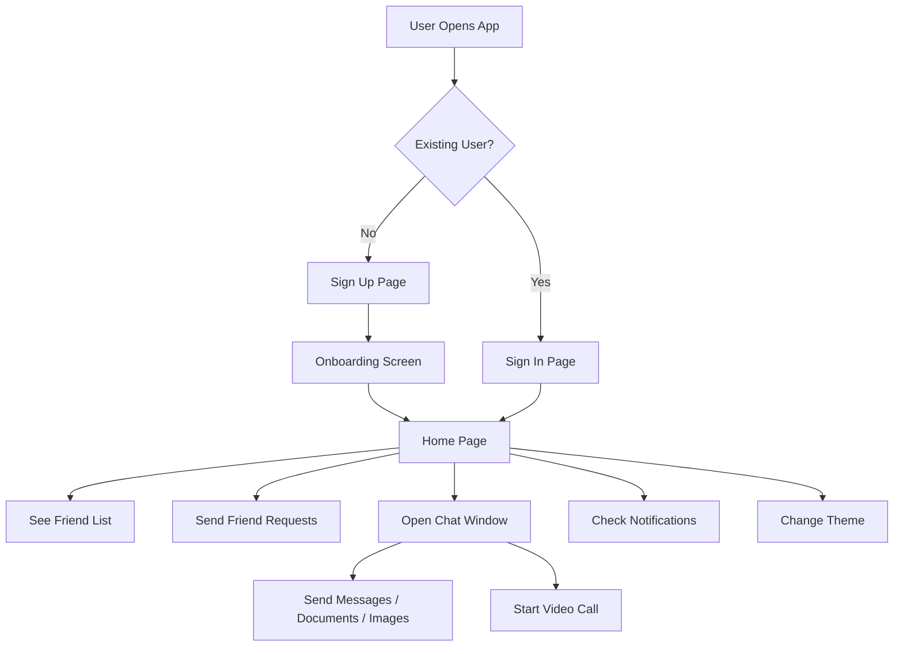

# 📚 Streamify – Frontend (React)

A modern **language‑learning chat application** offering real‑time messaging, video calling, social connections, and a smooth onboarding experience.

This README explains the full **frontend structure**, **user flow**, **features**, and includes a **complete flowchart** for clarity.

---

## 🚀 Features (Frontend)

### ✅ Authentication & Onboarding

* User **Sign Up**
* User **Sign In** (existing accounts go directly to Home)
* **Onboarding screen** shown only after first sign‑up

### 💬 Chat System

* 1‑to‑1 chat
* Send texts, documents, images, media
* Real‑time messaging with typing indicators & online status

### 🎥 Video Calling

* High‑quality peer‑to‑peer video/audio calls

### 👥 Social System

* Send/accept friend requests
* See all contacts
* Start chat anytime

### 🎨 Theme Customization

* Light / Dark mode
* Accent theme selection

### 🔔 Notifications

* Message notifications
* Request notifications
* Call notifications

---

## 📁 Project Structure (Frontend)

```
/src
 ├── components
 ├── pages
 ├── routes
 ├── context
 ├── hooks
 ├── services
 ├── styles
 └── utils
```

---

## 🔄 Complete User Flow (Frontend)



---

## 🏠 Home Page Overview

The Home Page contains:

* Chat list
* Friend request section
* Theme switcher
* Notifications panel
* Profile menu

---

## 🔧 Tech Stack (Frontend)

* **React**
* **React Router**
* **Context API / Zustand**
* **WebRTC** (for video calls)
* **Socket.io Client** (for real‑time chat)
* **Tailwind CSS / Custom SCSS**
* **Axios** (for API calls)

---

## 🚀 How to Run (Frontend)

```
npm install
npm start
```

---

## 📦 Build for Production

```
npm run build
```

---

## 🎯 Summary

Streamify provides a complete language‑learning communication experience with:
✔ Smooth onboarding
✔ Real‑time messaging
✔ Video calls
✔ Document sharing
✔ Friend system
✔ Fully customizable theme

---
